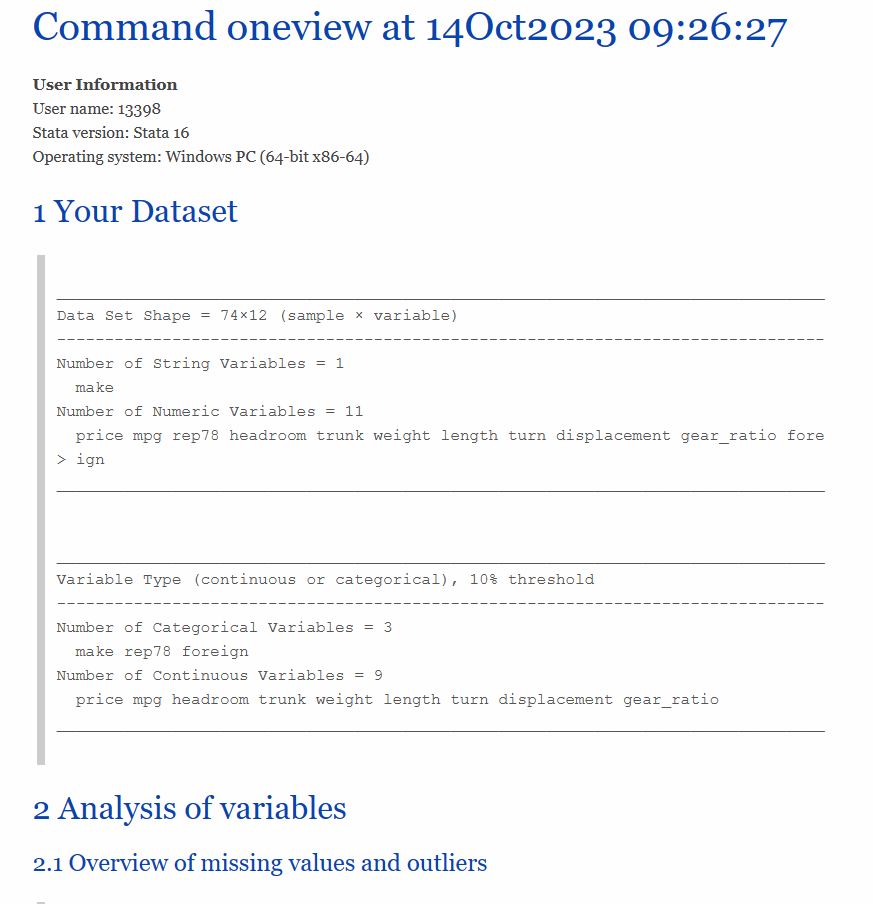

# stata-oneview

Command `oneview` makes it easy to implement exploratory analysis of data in Stata. 

`oneview` 命令致力于在 **Stata** 中实现对数据的探索性分析。

**Version**: Stata 16

**版本**：Stata 16

## 1. 安装

将本项目下载至本地。

```
git clone git@github.com:ShutterZor/stata-oneview.git
```

或者直接下载压缩包。

## 2. 使用

首先，打开解压后的压缩包，双击 `do` 文件，并选中后运行该文件。

其次，调用任意一份数据后，使用 `oneview` 加任意变量即可生成对应的网页文件。

```stata
sysuse auto.dta, clear
oneview make-foreign
```

## 3. 结果

运行结果如下图所示。



## 4. 其他说明

文件夹中的 `.css` 文件为样式文件，可以自行更改。
